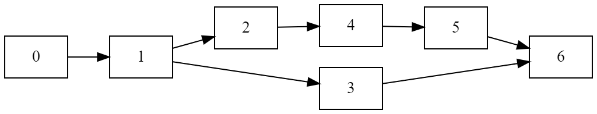
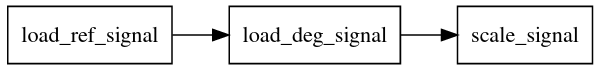
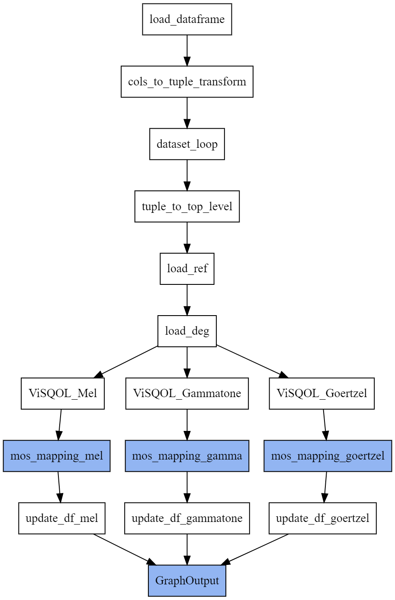

# Audio Quality Pipeline - AQP 

## A pipeline for running and comparing audio quality metrics

***

## Introduction

AQP is a highly module pipeline designed to enable the running and comparison of different configurations of quality metrics, such as ViSQOL, PESQ, Warp-Q, etc., on single reference/degraded signal input or on datasets containing information on the reference/degraded signals. 

AQP is built using Python and it's fundamental data structure is a Directed Acyclic Graph (DAG). Each node in the graph encapsulates some logic, e.g. loading a signal, scaling a signal, creating a spectrogram, etc. 



Alongside the DAG, the idea of aex component-based system is used to form the functionality of the pipeline. A result dictionary is declared before the pipeline is executed. This dictionary is passed to each node and it's contents are either retrieved to use as input to the encapsulated logic and/or updated with the results of executing the node. 

## Node Abstract Class

Nodes are used to encapsulate some unique logic/functionality, but there is common properties/functionality to all nodes. These are defined in the abstract Node class (found in nodes/node.py). 

```python
class Node(object):
    def __init__(self, id_: str, output_key: str, draw_options: dict, **kwargs):
        self.id_ = id_
        self.output_key = output_key
        self.draw_options = draw_options
        self.type = '__node__'

    def execute(self, result: dict, **kwargs):
        LOGGER.info(f'Executing node {self.id_} | type={self.type_}')
```

There are currently **three** class which inherit/implement the Node base class, the **AQPNode**, **ViSQOLNode** and **PESQNode**. The main reason for these classes is related to outputing the pipeline in **.dot** format for GraphViz. Each node class can have a dictionary called **draw_options** passed to it and it is used to control how the node will be drawn in the output image. The three Node implementations simply add specific draw options for nodes belonging to different use cases. More on this in the **Drawing the Pipeline** section. All other node classes implement one of the three previously mentioned classes. 

The **execute** function is main function of the pipeline, it is common to all nodes and is how data moves through the pipeline. The execute function takes in the result dictionary as an argument and should return the same dictionary in the majority of cases(more details on this in the **Advanced Nodes** section)

## Implementing a Node

Adding your own node is quick and easy to do. All it requires is to implement one of **AQPNode**, **ViSQOLNode**, **PESQNode** or your own base node that you've created. Then the ``__init__`` function and the ``execute`` function must be implemented. 

Example

```python
from .node import AQPNode

class MyCustomNode(AQPNode):
    
    # Note that output_key and draw_options are optional, so they do not have to be used if not needed.
    def __init__(self, id_: str, output_key: str, param_one: str, param_two: int, draw_options: dict=None, **kwargs):
        super().__init__(id_, output_key=output_key, draw_options=draw_options, **kwargs)
        self.param_one = param_one
        self.param_two = param_two
        # You MUST declare self.type_, this is used to logging purpose and just describe the name of the node
        self.type_ = 'MyCustomNode'
        
    def execute(self, result: dict, **kwargs):
        super().execute(result, **kwargs)
        output_value = result[self.param_one] * self.param_two
        result[self.output_key] = output_value
        return result
```

A real implemented node

```python
import math
import numpy as np
from .node import AQPNode

class ScaleSignalsNode(AQPNode):
    """Node used to scale two signals to the same Sound Pressure Level."""
    
    def __init__(self, id_: str,  
                 ref_sig_key: str='reference_signal', 
                 deg_sig_key: str='degraded_signal',
                 draw_options: dict=None, **kwargs):
        """Initialize a ScaleSignalsNode.
        
        Parameters
        ----------
        ref_sig_key : str, optional
            Key to retrieve the reference audio signal. The default is 'reference_signal'.
        deg_sig_key : str, optional
            Key to retrieve the degraded audio signal. The default is 'degraded_signal'.
        """
        super().__init__(id_, draw_options=draw_options)
        self.ref_sig_key = ref_sig_key
        self.deg_sig_key = deg_sig_key
        self.type_ = 'ScaleSignalNode'
    
    
    def execute(self, result: dict, **kwargs):
        """Execute the ScaleSignalNode and update the degraded signal key with the scaled signal."""
        super().execute(result)
        required_reference_spl = ScaleSignalsNode._calculate_SPL(result[self.ref_sig_key])
        required_degraded_spl = ScaleSignalsNode._calculate_SPL(result[self.deg_sig_key])
        result[self.deg_sig_key] *= (10 ** ((required_reference_spl - required_degraded_spl) / 20))
        return result
    
    
    @classmethod
    def _calculate_SPL(cls, signal: np.ndarray) -> float:
        return 20 * math.log10(math.sqrt(np.mean(np.square(signal))) / 20e-6)
```


## Creating a Simple Pipeline

### How the Pipeline is Created

The pipeline is defined as a collection of connected nodes. This information is described through a JSON configuration file. This file is passed to the program on startup as a command-line argument, ``--graph_config_path``, which has a default value of ``config/graph.json``. Each entry in the JSON file is used to describe some node in the pipeline. The key for an entry is used as a unique id for each node and is how nodes are connected together. The values associated with the key are then used as the construction parameters for a node, with some extra parameters, such as ``children`` and ``type`` being used to facilitate the creation of connections between nodes and instructing the pipeline in which type of node to create.

### Example

```json
{
    "load_ref_signal": {
        "type": "LoadSignalNode",
        "children": ["load_deg_signal"],
        "output_key": "reference_signal",
        "signal_path": "resources/reference/ref.wav",
        "file_name_key": "reference_file"
    },
    "load_deg_signal": {
        "type": "LoadSignalNode",
        "children": ["scale_signal"],
        "output_key": "degraded_signal",
        "signal_path": "resources/degraded/deg.wav",
        "file_name_key": "degraded_file"
    },
    "scale_signal": {
        "type": "ScaleSignalsNode"
    }
}
```

The above configuration results in a graph that looks like the image below. 



## Advanced Nodes

### LoopNode

The LoopNode is used to loop over some iterable entry in the result dictionary. When creating a LoopNode a definition is provided of all the nodes which it should loop over using each entry in the iterable object. Each iteration, a copy of the original dictionary is used (so as to avoid key conflicts), and this copy is then assigned to a results dictionary. The output of the loop node is this results dictionary, it gets assigned to the main result dictionary. The execute function of the LoopNode is shown below.

```python

def execute(self, result: dict, **kwargs):
	super().execute(result)
    results = {}
    for i in result[self.iterable_key]:
    	LOGGER.info("Running on iterable entry: %s", i)
        result_copy = {k: result[k] for k in result if k not in self.key_blacklist}
        result_copy['iterator_item'] = i
        graphutils.run_node(self.execution_node, result_copy)
        results[i] = result_copy
            
    result[self.output_key] = results
    return result
```

When creating the copy of the result dictionary, an additional list can be used to blacklist specified keys from appearing in the copy. This is useful when running quality metric configurations against each other, e.g. ViSQOL with a Mel Spectrogram against ViSQOL with a Gammatone Spectrogram. It prevents the output of each configuration being present when looping over another set of nodes. Without this, it is possible that the result dictionary ends up storing most of itself at the output key of a loop node. An example of using the blacklist is seen later in a more advanced graph config. 

### EncapsulationNode

The EncapsulationNode is mostly a utility node that can store a pipeline definition. Like the LoopNode, it also receives a sub-graph definition during construction and upon calling it's execute function it call each node contained within that sub-graph. This functionality is useful as it can be used to shorten graph configuration files, as well as reuse the same definition without having to redefine the graph again.

```python
def execute(self, result: dict, **kwargs):
	super().execute(result, **kwargs)
    graphutils.run_node(self.execution_node, result, **kwargs)
    return result
```

An EncapsulationNode can be created in one of two ways:

- Defining the sub-graph in the EncapsulationNode entry or by
- Providing a path to a JSON file containing the sub-graph definition.

An id of the starting node in the sub-graph must be provided in both cases.

```json
{
	"load_ref": {
		"children": ["load_deg"],
		"type": "LoadSignalNode",
		"signal_path": "resources/reference/ref.wav",
		"file_name_key": "reference_file",
		"output_key": "reference_signal"
	},
	"load_deg": {
		"children": ["ViSQOL_Mel"],
		"type": "LoadSignalNode",
		"signal_path": "resources/degraded/deg.wav",
		"file_name_key": "degraded_file",
		"output_key": "degraded_signal"
	},
	"ViSQOL_Mel": {
		"children": ["output"],
		"type": "EncapsulationNode",
		"start_node": "visqol_args",
		"path_to_node_config": "config/visqol/graphs/default_visqol_mel.json"
	},
    "output": {
        "type": "IdentityNode"
    }
}
```

The JSON below is the contents of ``config/visqol/graphs/default_visqol_mel.json`` 

```json
{

	"visqol_args": {
		"output_key": "visqol_args",
		"children": ["channel_loop"],
		"type": "VisqolStructuresNode",
		"config_file_path": "config/visqol/structures/default_visqol_mel_structures.json"
	},
	"channel_loop": {
		"output_key": "vnsims_mel",
		"type": "LoopNode",
		"iterable_key": "active_channels",
        "key_blacklist": ["wav_files", "vnsims_gamma", "vnsims_mel", "vnsims_goertzel"],
		"start_node": "extract_channels",
		"node_data": {
			"extract_channels": {
				"children": ["scale_signals"],
				"type": "ViSQOLChannelNode"
			},
			"scale_signals": {
				"children": ["ref_spect"],
				"type": "ScaleSignalsNode"
			},
			"ref_spect": {
				"children": ["deg_spect"],
				"output_key": "reference_spect",
				"type": "SpectrogramNode",
				"signal_key": "reference_signal",
				"file_name_key": "reference_file",
				"save_spectrogram": true,
				"output_dir": "spectrograms/mel/"
			},
			"deg_spect": {
				"children": ["floor_spect"],
				"output_key": "degraded_spect",
				"type": "SpectrogramNode",
				"signal_key": "degraded_signal",
				"file_name_key": "degraded_file",
				"save_spectrogram": true,
				"output_dir": "spectrograms/mel/"
			},
			"floor_spect": {
				"children": ["reference_patches"],
				"type": "FloorSpectrogramsNode"
			},
			"reference_patches": {
				"children": ["vad"],
				"type": "ReferencePatchNode"
			},
			"vad": {
				"children": ["patch_alignment"],
				"type": "VADNode"
			},
			"patch_alignment": {
				"children": ["patch_similarity"],
				"type": "PatchAlignmentNode"
			},
			"patch_similarity": {
				"children": [],
				"type": "PatchSimilarityNode"
			}
		}
	}
}
```

### SinkNode

The SinkNode is a relatively simple but useful node. It's purpose is prevent the execution of the nodes below it in the pipeline until it has received a set number of results from different branches. Once it has seen the expected number of results, the result is passed to the child nodes of the SinkNode. 

When executing the pipeline, each node has it's execute function called. This normally returns the result dictionary and execution continues. In this case, each of the children of the current node being executed are added to a Stack (pipeline operates using a modified Depth First Traversal). However, if the return value is None, then the children of the current node don't get added to the Stack and instead, execution continues using the next node on the same level of the graph as the current node. 

The SinkNode allows for the collection of different results before they are passed to an output node for a node which relies on having multiple different results.

```python
def execute(self, result: dict, **kwargs):
	super().execute(result, **kwargs)
    self.counter += 1
    return result if self.counter == self.num_expected_results else None
```


### TransformNode

The TransformNode contains several transformation function which can be used to operate on some data contained within the result dictionary. These functions/transforms could have been encapsulated into their own nodes, but they're short and having each of them be defined separately would bloat the nodes directory further. The transforms so far, are designed around taking some value(s) from the result dictionary and creating some new value or remove a layer of nesting etc. So far there are three transforms used:

- ``df_columns_to_tuples``: when a dataset is loaded from a csv file the reference and degraded files are in different columns, this transform makes a single list of tuples from these columns. 
- ``tuple_to_top_level``: When iterating (using a LoopNode) over the list of tuples described above, the individual parts need to be extracted so as to load the reference and degraded signal. This transform retrieves the current tuple, and assigns each value back to the dictionary.
- ``update_df``: After running a quality metric on a signal, the results for that signal needs to be stored somewhere, so as to be to graph them later on. This needs to happen per signal tested. This transform locates the correct row in the loaded dataframe based off of the reference file and updates a (new) column with the results of the signal. 

Each function available in the TransformNode takes it's own unique arguments. These arguments should be provided in the definition of the TransformNode using the ``function_args`` field. These values get upacked during execution for use. 

Example

```json
{
	"type ": "TransformNode",
	"transform_name": "tuple_to_top_level",
	"target_key": "iterator_item",
	"function_args": {
		"reference_file_key": "reference",
		"degraded_file_key": "degraded"
	}
}
```


## Advanced Pipeline Example

### Comparing ViSQOL Configuration

```json
{
	"load_dataframe": {
		"type": "LoadCSVAsDFNode",
		"children": ["cols_to_tuple_transform"],
		"output_key": "dataframe",
		"path_to_csv": "resources/dataset.csv"
	},
	"cols_to_tuple_transform": {
		"type": "TransformNode",
		"children": ["dataset_loop"],
		"transform_name": "df_columns_to_tuples",
		"target_key": "dataframe",
		"output_key": "wav_files",
		"function_args": {
			"col_one": "ref_wav",
			"col_two": "deg_wav"
		}
	},
	"dataset_loop": {
		"type": "LoopNode",
		"children": ["output"],
		"output_key": "dataset_output",
		"iterable_key": "wav_files",
		"start_node": "tuple_to_top_level",
		"key_blacklist": ["wav_files", "vnsims_gamma", "vnsims_mel", "vnsims_goertzel"],
		"node_data": {
			"tuple_to_top_level": {
				"type": "TransformNode",
				"children": ["load_ref"],
				"transform_name": "tuple_to_top_level",
				"target_key": "iterator_item",
				"function_args": {
					"reference_file_key": "reference",
					"degraded_file_key": "degraded"
				}
			},
			"load_ref": {
				"type": "LoadSignalNode",
				"children": ["load_deg"],
				"file_name_key": "reference_file",
				"signal_key": "reference",
				"output_key": "reference_signal"
			},
			"load_deg": {
				"type": "LoadSignalNode",
				"children": ["ViSQOL_Mel", "ViSQOL_Gammatone"],
				"signal_key": "degraded",
				"output_key": "degraded_signal",
				"file_name_key": "degraded_file"
			},
			"ViSQOL_Mel": {
				"type": "EncapsulationNode",
				"children": ["update_df_mel"],
				"start_node": "visqol_args",
				"path_to_node_config": "config/visqol/graphs/default_visqol_mel.json"
			},
			"update_df_mel": {
				"type": "TransformNode",
				"transform_name": "update_df_by_active_channels",
				"target_key": "dataframe",
				"function_args": {
					"key": "vnsims_mel.{}.vnsim"
				}
			},
			"ViSQOL_Gammatone": {
				"type": "EncapsulationNode",
				"children": ["update_df_gammatone"],
				"start_node": "visqol_args",
				"path_to_node_config": "config/visqol/graphs/default_visqol_gammatone.json"
			},
			"update_df_gammatone": {
				"type": "TransformNode",
				"transform_name": "update_df_by_active_channels",
				"target_key": "dataframe",
				"function_args": {
					"key": "vnsims_gammatone.{}.vnsim"
				}
			},
			"ViSQOL_Goertzel": {
				"type": "EncapsulationNode",
				"children": ["update_df_goertzel"],
				"start_node": "visqol_args",
				"path_to_node_config": "config/visqol/graphs/default_visqol_goertzel.json"
			},
			"update_df_goertzel": {
				"type": "TransformNode",
				"transform_name": "update_df_by_active_channels",
				"target_key": "dataframe",
				"function_args": {
					"key": "vnsims_goertzel.{}.vnsim"
				}
			}
		}
	},
	"output": {
		"type": "IdentityNode"
	}
}
```


## Drawing the Pipeline

It is possible to output a diagram of the pipeline. This functionality is based on a combination of [GraphViz](https://graphviz.org/) and the [NetworkX](https://networkx.org/) python package. If the ``--plot_graph`` command-line argument is set, then a NetworkX version of the pipeline is built, has the ``draw_options`` associated with each node applied to the NetworkX version of the node, and finally a ``.dot`` file is generated for the graph, which can be visualized with GraphViz. Currently, only one version of the graph is produced, where all nodes, that aren't part of an EncapsulationNode are graphed. 

Ideally, EncapsulationNodes will be included in future, the current issue with it relates to loop nodes within an encapsulation node and connecting them to the appropriate nodes. A

Another future possibility is the drawing of a box, or something similar around loop nodes and encapsulation nodes, to highlight that they are different from the rest of the graph.



